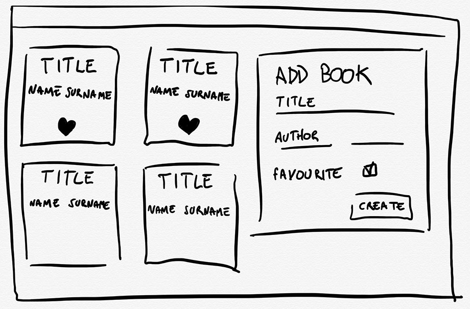

# Weekly assessment 6 - Alternative (4 hours)

This is your final weekly assessment, it sums up many concepts you’ve learned in the junior part of the course, and it marks your passage to the senior part.

You have to create a full-stack app to post and list books.

Make sure to:

- Use proper indentation.
- Comment your code where needed.
- Lint your code before committing.
- Commit often and follow the [Semantic Commit Message](https://seesparkbox.com/foundry/semantic_commit_messages) convention.

## Front End

Start by creating the Front End, in the meantime you can use this [Apiary documentation](https://favbooks.docs.apiary.io/).

- Use the React CLI to set-up the client folder, running `create-react-app client`.
- Your app should allow users to do the following:
  - View a list of your list of books sorted for author's surnames.
  - Render the favourites books before in the list with the favourites icon.
  - Add a new book. When a new book is added, the book list should reflect the changes automatically and the form fields should be cleaned.
  - When styling your application, you *must* use vanilla CSS.



## Back End

Replace the provided Apiary with your own implementation.

Create a `/server` folder and implement an [Express](https://expressjs.com/) REST server connected to a MongoDB database with [Mongoose](http://mongoosejs.com/). It should offer the following API methods:

- `POST /books` - Creates a new record in the database with the following parameters:

  - `title`: *String*. The title of the book.
  - `author_name`: *String.* The name of the book author.
  - `author_surname`: *Sting.* The surname of the book author.
  - `favourite`: *Bool*. If its in your favourite list.

  All these parameters are mandatory. The server should return a `201` status code for success, and a `400` HTTP status code in case any parameter is missing.

- `GET /books - Returns a list of all books stored in the database, in JSON format. 

  ```json
  [
    {
        "_id": "234tyghu01",
        "title": "Eloquent JavaScript",
        "author_name": "Marijn",
        "author_surname": "Haverbeke",
        "favorite": true
    }, {
        "_id": "4566iyguh",
        "title": "JavaScript: The Good Parts",
        "author_name": "Douglas",
        "author_surname": "Crockford",
        "favorite": false
    }
  ]
  ```

## Extra credits

- Manage the global state with `React.Context`
- Show a loader (e.g. spinner) when fetching the event list.
- Create an `ApiClient` service as a JavaScript Module that shares the logic for calling `fetch` and abstracts it behind methods (i.e.: `apiClient.getBooks()`).
