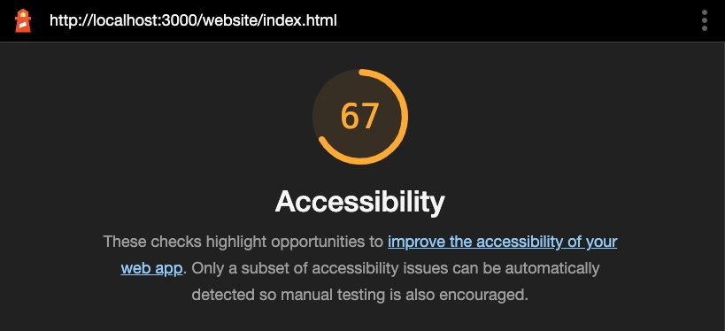

# Web Accessibility 

In this exercise, we’ll focus on Web Accessibility: making our websites and web applications accessible to everyone, regardless of their access needs.

Before you dive into the exercise, you’ll need to learn a little bit about Web Accessibility (or A11y for short, pronounced 'allie') and the standards that surround it. So, buckle up and get ready for some essential acronyms!

First, watch this [introduction](https://www.youtube.com/watch?v=20SHvU2PKsM) to Web Accessibility from the World Wide Web Consortium.

Then, watch this [video](https://www.youtube.com/watch?v=g9Qff0b-lHk) to get introduced to **WAI-ARIA**, one of the most powerful tools for making our websites and apps accessible.

Finally, watch a couple of short videos provided by the W3C WAI to get learn about the different aspects of web accessibility:

- [Web Accessibility Perspectives: Color Contrast](https://www.youtube.com/watch?v=Hui87z2Vx8o)
- [Web Accessibility Perspectives: Large Links, Buttons, and Controls](https://www.youtube.com/watch?v=CzfKB3PuuIY)
- [Web Accessibility Perspectives: Clear Layout and Design](https://www.youtube.com/watch?v=tfkzj5VC9P8)

## Learning Objectives

After watching the videos, you should now be familiar with the following terms and important concepts:

- Web Accessibility ensures that people with disabilities can use the Web equally
- There are over 1 billion people with disabilities in the world (~15-20% of the population)
- Access to information and the Web is a human right
- Web Accessibility: essential for some, useful for all

**Terms:**

- Web Content Accessibility Guidelines (WCAG)
- WCAG Principles: Perceivable, Operable, Understandable, Robust
- Authoring Tool Accessibility Guidelines (ATAG)
- User Agent Accessibility Guidelines (UAAG)
- Web Accessibility Initiative (WAI)
- Accessible Rich Internet Applications (ARIA): it’s mostly about special HTML attributes that help you build accessible websites and web apps
- Accessibility Tree: created based on the DOM and ARIA attributes

## Getting Started

For this exercise, you’ll need to run a local web server to host the `website/` folder which contains all the data. You can use the `Live Server` VSCode [extension](https://marketplace.visualstudio.com/items?itemName=ritwickdey.LiveServer) for that. Once you’ve installed the extension, run the `website/index.html` file with it.

You will be working, mainly with 3 files: `index.html`, `css/style.css` and `js/main.js`.

## Tasks

Your goal will be to make all the necessary changes to the code (html, css, js) to ensure that the website scores as high as possible in the tests below. Start simple, by adding "aria", "role" and "alt" attributes to the HTML where appropriate then follow the audits for deeper accessibility boosts!

- [W3C Validator](https://validator.w3.org/nu/#textarea) - This is the message that we want to see when we try and validate our markup (HTML) through the validator: **Document checking completed. No errors or warnings to show.** Make sure to fix all the errors and warnings in order to achieve a 100% green score on this tool. When validating the original `index.html` file through the W3C tool, expect to see around 29 errors and warnings initially.

- [Axe DevTools](https://chrome.google.com/webstore/detail/axe-devtools-web-accessib/lhdoppojpmngadmnindnejefpokejbdd) - Run a full page scan and refactor according to the suggested changes. When validating the original `index.html` file through the Axe tool, expect to see around 83 issues initially. There’s also a Firefox version for the [Axe DevTools Extension](https://addons.mozilla.org/en-US/firefox/addon/axe-devtools/) but we recommend that you use the Chrome version for this exercise.

- [Chrome Lightouse: Accessibility Auditing](https://web.dev/accessibility-scoring/) - Run the Accessibility test for Desktop and make sure to follow the suggestions and resources provided by the tool to refactor and get a higher score: 90-100% (green). When validating the original `index.html` file through the Accessibility tester of Lighthouse, expect to see a score around 67% (orange).

## Troubleshooting

If you are getting the following error while trying to evaluate the accessibility of the website with the `Axe DevTools` Chrome Extension: 

`We’re sorry, but axe DevTools was unable to analyze the current tab.`

Open the Extension Settings and enable the following options. Next, close the DevTools, reload the page, open the DevTools and access the Axe DevTools tab and check again.

- ✅ Allow in Incognito
- ✅ Allow access to file URLs

## Notes

- Don’t forget to follow the resources and links provided both by `Axe` and `Lighthouse` tools to find out more about each issue as well as clues on how to fix them. Also, check out the `Resources` section below which contains useful resources for dealing with some of the issues.

- If you are stuck fixing a particular issue for too long, feel free to move on and come back to that issue at a later time.

## Resources

- Axe Issue: [Elements must have sufficient color contrast](https://contrast-ratio.com/#%23a6a6a6-on-white)
- Axe Issue: [All page content must be contained by landmarks](https://dequeuniversity.com/rules/axe/4.4/region)
- Issue: [Elements with an ARIA [role] that require children to contain a specific [role] are missing some or all of those required children](https://web.dev/aria-required-children/)

- Axe Issue: `<li>` elements must be contained in a `<ul>` or `<ol></ol>`
  - [Erroneous: "List items (\<li>) are not contained within \<ul> or \<ol> parent elements."](https://github.com/GoogleChrome/lighthouse/issues/9643)
  - [Not properly processing lists](https://github.com/dequelabs/axe-core/issues/2415)
  - [How to fix role="tablist"/role="tab" Axe violations?](https://stackoverflow.com/questions/69756534/how-to-fix-role-tablist-role-tab-axe-violations)

- Axe Issue: Buttons must have discernible text
  - [Owl Carousel Docs](https://owlcarousel2.github.io/OwlCarousel2/docs/api-events.html)
  - [Owl carousel 2.2 dots with aria-label](https://stackoverflow.com/questions/41818880/owl-carousel-2-2-dots-with-aria-label)
  - [Use aria-label on a span](https://stackoverflow.com/questions/54141817/use-aria-label-on-a-span)
  - [Accessible Owl Carousel](https://codepen.io/kelsS/pen/LreGKN?editors=0010)

## Extra Credits

- Run the `Chrome Lighthouse Auditing Tool` with the `Performance`, `SEO` and `Best Practices` options enabled and refactor accordingly to achieve an even higher score on all cases.
